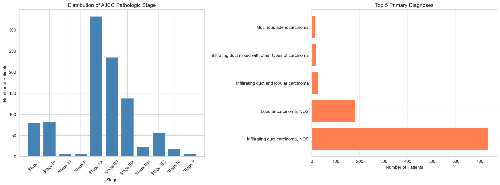
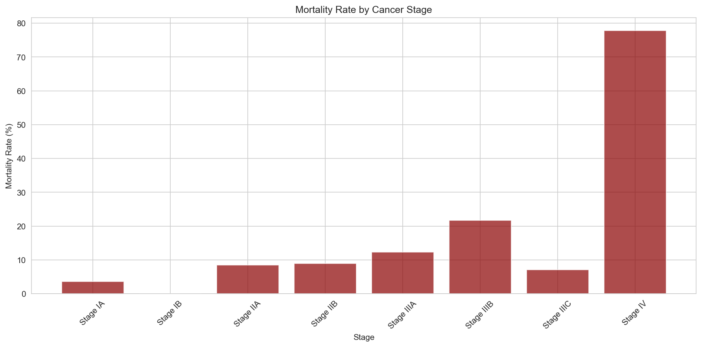
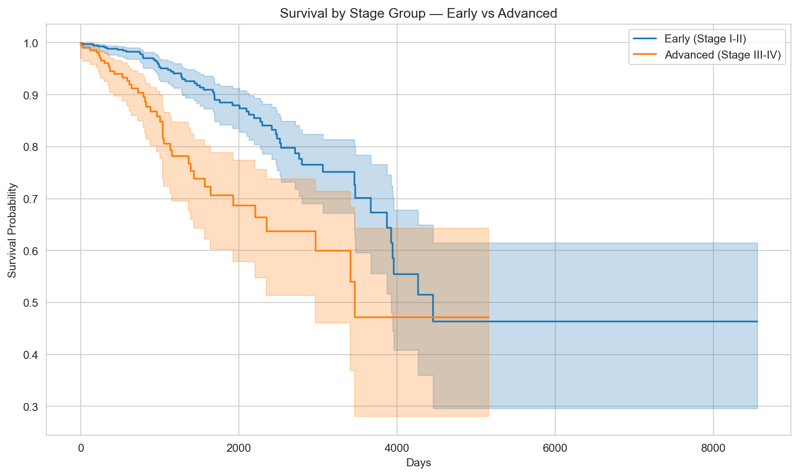
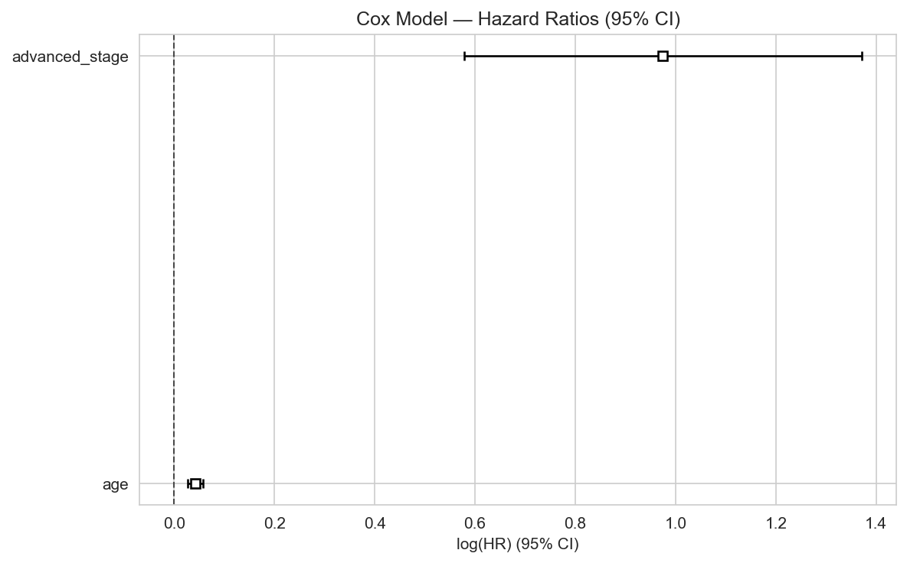
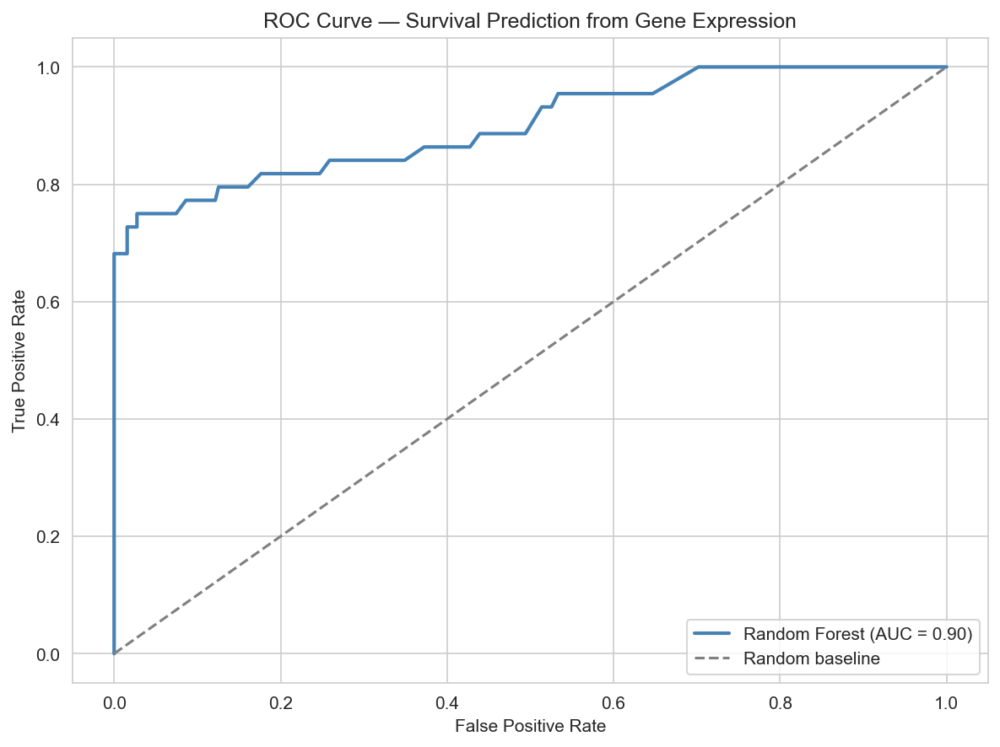
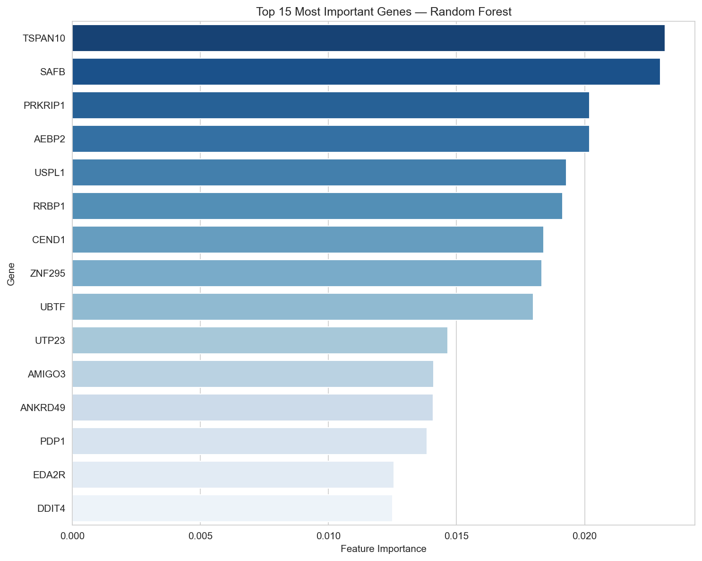

# TCGA Clinical Data Analysis — Exploratory Analysis and Survival Insights

Exploratory data analysis (EDA) of clinical data from The Cancer Genome Atlas (TCGA), a landmark cancer genomics program that has molecularly characterized over 20,000 primary cancer samples spanning 33 cancer types.

This project applies Python-based data analysis tools to extract patterns and insights from real-world clinical oncology data, covering patient demographics, diagnosis, treatment, and survival outcomes.

---

## Objectives

- Clean and preprocess raw, nested TCGA-GDC clinical data
- Explore patient demographics and diagnosis distributions (focusing on TCGA-BRCA)
- Perform rigorous survival analysis (Log-rank test, Kaplan-Meier, Cox Proportional Hazards)
- Quantify the independent clinical impact of age and stage on mortality
- Predict patient survival from gene expression profiles using LASSO + Random Forest-
---

## Repository Structure

```
tcga-clinical-analysis/
├── notebooks/
│   ├── 01_data_cleaning.ipynb                      # Data loading, cleaning, preprocessing
│   ├── 02_exploratory_analysis.ipynb               # EDA: distributions, demographics, patterns
│   ├── 03_survival_insights.ipynb                  # Survival analysis and key findings
│   └── 04_transcriptomic_target_discovery.ipynb    # ML survival prediction from gene expression
├── data/
│   └── README.md                                   # Data source and download instructions
├── results/
│   └── plots/                                      # Output visualizations
├── requirements.txt                                # Python dependencies
├── .gitignore
└── README.md
```

---

## Dataset

**Clinical data source**: [GDC Data Portal — TCGA](https://portal.gdc.cancer.gov/)

TCGA clinical data includes:
- Patient demographics (age, gender, ethnicity)
- Diagnosis information (cancer type, stage, histology)
- Treatment data (surgery, radiation, chemotherapy)
- Survival outcomes (overall survival, days to death/last follow-up)

**Gene expression source**: [UCSC Xena — TCGA-BRCA HiSeq V2](https://xenabrowser.net/)
- 20,530 genes, log2-normalized RNA-seq counts
- 1,218 tumor samples
---

## Analysis Pipeline

### 1. Data Cleaning (`01_data_cleaning.ipynb`)
- Load raw clinical TSV files from GDC portal
- Handle missing values and inconsistent formatting
- Standardize column names and data types
- Export clean dataset for downstream analysis

### 2. Exploratory Analysis (`02_exploratory_analysis.ipynb`)
- Distribution of cancer types and subtypes
- Patient age and gender distributions
- Stage at diagnosis across cancer types
- Treatment patterns and frequencies
- Correlation analysis between clinical variables

### 3. Survival Insights (`03_survival_insights.ipynb`)
- Overall survival distributions by cancer type
- Kaplan-Meier survival curves
- Factors associated with survival outcomes (age, stage, treatment)
- Key clinical insights and findings summary

### 4. ML Survival Prediction (`04_transcriptomic_target_discovery.ipynb`)
- Merge gene expression (HiSeq V2) with clinical phenotype data
- LASSO feature selection: reduce 20,530 genes to informative subset
- Random Forest classifier with class balancing
- ROC-AUC evaluation and feature importance analysis


---

## Dependencies

```bash
pip install -r requirements.txt
```

| Package | Purpose |
|---------|---------|
| pandas | Data manipulation and cleaning |
| numpy | Numerical computing |
| matplotlib | Static visualizations |
| seaborn | Statistical data visualization |
| lifelines | Survival analysis (Kaplan-Meier) |
| scikit-learn | Machine learning (LASSO, Random Forest) |
| jupyter | Notebook environment |

---

## Usage

```bash
# Clone the repo
git clone https://github.com/Santi-20L/tcga-data-analysis.git
cd tcga-data-analysis

# Install dependencies
pip install -r requirements.txt

# Download data from GDC portal and UCSC Xena
# Place files in data/ folder (see data/README.md)

# Run notebooks in order
jupyter notebook notebooks/01_data_cleaning.ipynb
```

---

## Results

### Clinical Analysis (Notebooks 1–3)

**Cohort**: 1,036 TCGA-BRCA patients (1,025 female, 11 male), median age in the late 50s.

#### Stage and Diagnosis Distribution



Most patients were diagnosed at Stage II, with Infiltrating duct carcinoma as the predominant histological subtype (~71% of cases) consistent with established breast cancer epidemiology.

#### Mortality by Stage



Mortality increases with stage at diagnosis, from ~4-9% in early stages (IA-IIB) to ~78% in Stage IV. Stage IIIB showed a higher-than-expected mortality rate, likely due to its small sample size (n=23) rather than a genuine biological effect.

#### Survival Analysis: Early vs Advanced Stage



Kaplan-Meier curves show a clear separation in overall survival between early-stage (I-II, n=742) and advanced-stage (III-IV, n=235) patients. A log-rank test confirmed this difference is statistically significant (p = 3.53e-06).

#### Cox Proportional Hazards Model



A Cox model quantified the independent contribution of age and stage to mortality risk:

| Variable | Hazard Ratio | p-value | Interpretation |
|----------|-------------|---------|----------------|
| Age | 1.04 | < 0.005 | +4% risk per year of age |
| Advanced stage (III-IV) | 2.65 | < 0.005 | 2.65× higher risk vs early stage |

Concordance index: **0.74**. Stage at diagnosis emerged as a substantially stronger predictor of mortality than age, reinforcing the clinical value of early detection.

---

### ML Survival Prediction (Notebook 4)

**Cohort after merge**: 1,492 patients (1,274 alive, 218 deceased — 14.6% positive class)

#### ROC Curve — Random Forest



**AUC = 0.901**, the LASSO + Random Forest pipeline achieves high discriminative performance, correctly distinguishing deceased from alive patients in 90.1% of cases using gene expression data alone.

#### Top 15 Predictive Genes



| Gene | Importance |
|------|-----------|
| TSPAN10 | 0.0232 |
| SAFB | 0.0230 |
| PRKRIP1 | 0.0202 |
| AEBP2 | 0.0202 |
| USPL1 | 0.0193 |
| RRBP1 | 0.0191 |
| CEND1 | 0.0184 |
| ZNF295 | 0.0183 |
| UBTF | 0.0180 |
| UTP23 | 0.0147 |
| AMIGO3 | 0.0141 |
| ANKRD49 | 0.0141 |
| PDP1 | 0.0138 |
| EDA2R | 0.0126 |
| DDIT4 | 0.0125 |

LASSO reduced the feature space from 20,530 to **162 informative genes**. Several top predictors have known cancer relevance: EDA2R and DDIT4 are stress-response/apoptosis genes; UBTF is involved in ribosomal RNA transcription frequently dysregulated in cancer; AEBP2 is a Polycomb complex component associated with epigenetic regulation in breast cancer.

---

## Author

**Santi Isgrò**
BSc in Computer Science — Università degli Studi di Catania,
MSc in Bioinformatics — in progress

---

## License

MIT License
